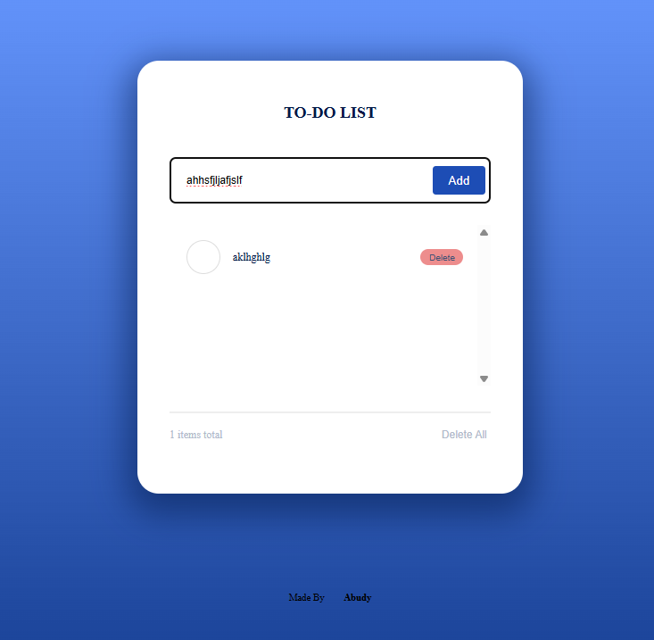
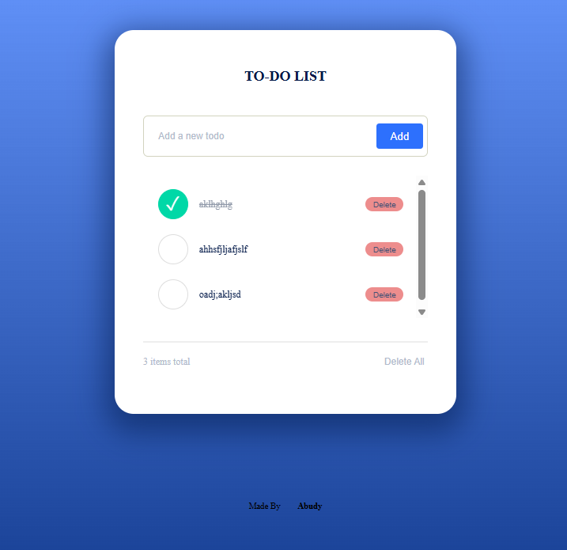
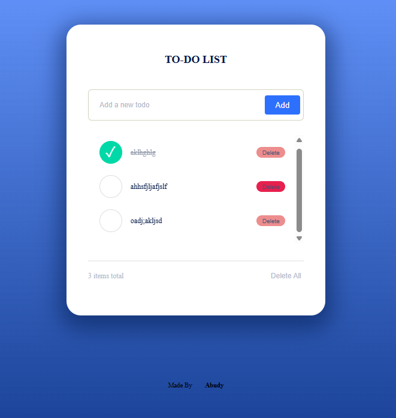

# Todo App (TypeScript)

A simple browser-based Todo App, converted from JavaScript to TypeScript. Add, edit, complete, and delete tasks, also tasks saved to `localStorage` so your list stays after refresh.

## Screenshots





## Features

- Add, edit, complete, and delete tasks
- Delete all tasks at once
- Task count display
- Data saved in `localStorage`

## Setup

1. Install [Node.js](https://nodejs.org)
2. Install TypeScript:
   ```bash
   npm install typescript --save-dev
   ```
3. Compile:
   ```bash
   npx tsc
   ```
4. Open `index.html` in your browser.

## Author

Abdulkadir